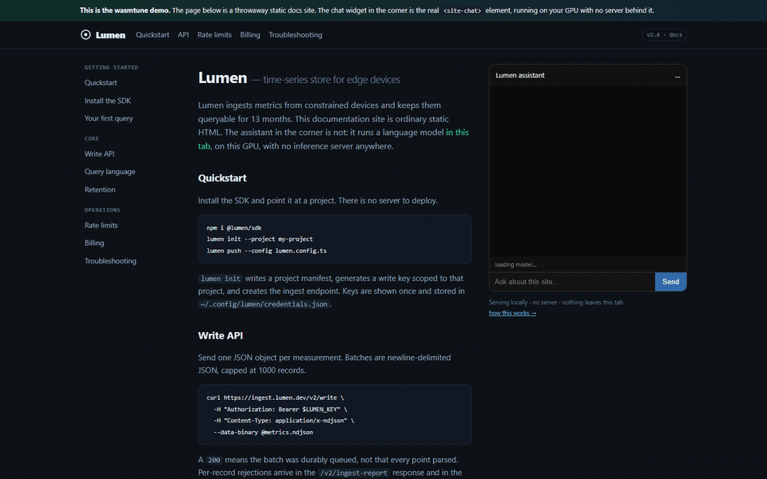
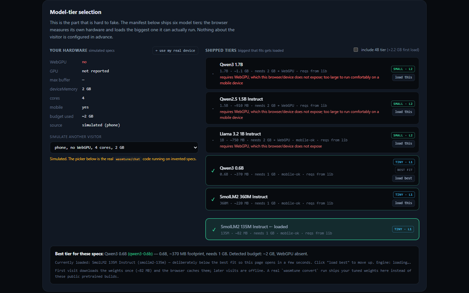

# WasmTune

[](https://www.npmjs.com/package/wasmtune)
[](./LICENSE)

Fine-tune a small LLM on **your own website's pages**, then ship it as a chat
window that runs **in the visitor's browser** — over WebGPU, with no inference
server, no API key, and no bill per question.

Point a config at the folder holding your site content, and the pipeline does the
rest: crawl → build a QA-heavy dataset → LoRA/QLoRA locally → gate on a held-out
eval → convert to GGUF + MLC + ONNX → emit a manifest. The browser then measures
each visitor's own hardware and loads the **biggest model tier that actually
fits it**.

## ▶ Live demo

**https://warsang.github.io/wasmTune/**

A throwaway static docs site with a real `<site-chat>` element in the corner,
running on your GPU. Below it, the tier picker driven by the library's own
`detectHardware` / `fitReport` / `pickModel` — plus a visitor simulator, so you
can see what a phone gets from any machine.



<sub>Captured from the live demo. Frames: the site and its widget → this
machine's detected hardware and best-fit tier → the same picker run against a
simulated 2 GB phone, where three tiers are rejected with reasons → the RAG
comparison.</sub>

Open it with [`?sim=phone`](https://warsang.github.io/wasmTune/?sim=phone) to see
the low-end path, or [`?tiers=large`](https://warsang.github.io/wasmTune/?tiers=large)
to add the 4B tier.

## Quickstart

Five commands, then two lines of HTML. `dataDir` is any folder of
`md`/`mdx`/`txt`/`html`/`js`/`json` — your docs, your content, your repo.

```bash
npm i -D wasmtune
npx wasmtune dataset --dataDir ./docs --model Qwen/Qwen2.5-1.5B-Instruct
npx wasmtune train   --dataDir ./docs --model Qwen/Qwen2.5-1.5B-Instruct --epochs 3
npx wasmtune eval    # gate: the tuned model must beat the base, or the build fails
npx wasmtune convert # merged weights -> GGUF + MLC (q4f16_1) + ONNX + manifest
npx wasmtune eval-onnx   # scores the artifact that ships, not the fp16 weights
HF_TOKEN=hf_… npx wasmtune publish   # optional: upload to the Hub + manifest entry
```

```html
<script type="module">
  import { mountAssistant } from 'wasmtune/chat';
  await mountAssistant({ target: '#chat', siteName: 'Lumen' });
</script>
<div id="chat"></div>
```

That is the whole integration. `mountAssistant` fetches the manifest, detects
the visitor's hardware, picks a tier, mounts the widget, and owns the failure
banners. The first visitor downloads the weights once and the browser caches
them; every later visit is **fully offline**.

`eval-onnx` runs after `convert` because quantization can cost accuracy that
`eval` (which scores fp16 weights) cannot see — it scores the quantized graph the
widget actually loads and fails the run if it dropped more than 10%.
`publish` is deliberately separate from `convert`: retraining is
nondeterministic, so a build hook must not churn published weights.

Run `npx wasmtune train --dry-run` to see the resolved config and the reward
module before it installs anything.

## Why not just use RAG with a vector DB?

Both approaches answer from your content. Only one of them needs a running
server to do it.

| | wasmtune | Hosted RAG / vector DB |
|---|---|---|
| **Inference runs** | **in the visitor's tab**, over WebGPU | on your GPU box or a vendor's cluster |
| **Server bill** | **$0** — the weights are static files on a CDN | per query, forever, plus an always-on indexer |
| **Needs a backend** | no — any static host: Pages, Netlify, S3, nginx | yes: a service with uptime, scaling and alerts |
| **Network at answer time** | **zero** — works in airplane mode | at least one round trip per question |
| **User content** | never leaves the device | shipped to a third party on every question |
| **Per-visitor quality** | **automatic** — each visitor gets the biggest tier *their* hardware can run | one server config for everyone |
| **Grounding** | weights are fine-tuned on your pages, so it answers in your vocabulary | retrieval, re-ranking and a generation step |
| **Refresh cost** | re-crawl + retrain in CI | re-embed and re-index |
| **Where it loses** | small stable corpus; short answers, no verbatim quotes | loses on large or fast-changing corpora, citations, and questions spanning many documents |

**The honest trade.** If your corpus is large, changes hourly, or you need
verbatim quotes with citations, use RAG — it is genuinely better at that. wasmtune
is for the other half of the problem: a small, fairly stable set of pages, and a
question a 1B model can answer without inventing anything. There, a fine-tuned
model in the browser beats a retrieval stack, because you delete the stack.

## The pipeline

```bash
wasmtune dataset    # crawl dataDir -> QA-heavy training set (HTML -> Markdown)
wasmtune train      # SFT / DPO / ORPO / GRPO, LoRA
wasmtune eval       # held-out prompts, base vs tuned; non-zero exit on regression
wasmtune convert    # merged weights -> GGUF + MLC + ONNX, one manifest, quantized
wasmtune eval-onnx  # scores the artifact that ships — the gate that matters
HF_TOKEN=… wasmtune publish   # upload to the Hub + write the manifest entry
```

1. `wasmtune dataset` — crawl `dataDir` into a QA-heavy training set. HTML is
   converted to structure-preserving Markdown, not tag-stripped (see
   *Extraction* below).
2. `wasmtune train` — LoRA/QLoRA locally.
   - NVIDIA Linux/Windows → **Unsloth + TRL + PEFT** (CUDA kernels, fastest).
   - Apple Silicon (M1–M5) → **MLX** via `mlx-lm` / `unsloth-mlx` (unified memory).
3. `wasmtune eval` — held-out prompts, base vs tuned. Non-zero exit on regression.
4. `wasmtune convert` — merged weights → GGUF + MLC (`q4f16_1`) + ONNX, one
   manifest. The ONNX is quantized and deduplicated here.
5. `wasmtune eval-onnx` — scores the quantized graph the widget will load, not
   the fp16 weights eval scored. Non-zero exit if quantization cost more than
   `WASMTUNE_QUANT_DROP`. **Run this before publishing.**
6. `wasmtune publish` — upload to the Hugging Face Hub, verify the sha256 of
   what landed, and write the manifest entry itself. Optional: needs
   `HF_TOKEN`, changes nothing else.
7. Embed `<site-chat>` — **WebLLM (WebGPU) primary**, Transformers.js and wllama
   fallback. Served locally, no server inference.

Real Unsloth is CUDA-only and does not train on Metal — that is why this package
routes by platform instead of pretending one backend fits all.

## Extraction: HTML becomes Markdown, not a tag-free word stream

`wasmtune dataset` never strips tags with a regex. `<h2>` becomes `##`,
`<pre><code>` becomes a fenced block, `<table>` becomes a pipe table, and nav /
footer / aside chrome is dropped rather than trained on.

This is the single highest-leverage step in the dataset stage, and the number is
not small: **AICC / MinerU-HTML** ([arXiv:2511.16397](https://arxiv.org/abs/2511.16397))
holds corpus filtering constant and finds extraction quality alone worth
**+1.08pp across 13 pretraining benchmarks**; **Nemotron-CC-Math**
([arXiv:2508.15096](https://arxiv.org/abs/2508.15096)) corroborates
independently. For a small corpus the extraction *is* the quality budget.

The converter is dependency-free (this package ships zero dependencies) and its
limits are stated rather than implied: images are dropped, nested markup inside
table cells is flattened. Source is `src/dataset/markdown.mjs`.

## Choosing a method

| method | what it does | use it for |
|---|---|---|
| `sft` | next-token prediction on reference answers | **facts**. The validated path. |
| `dpo` | ranks a good answer above a bad one | removing a specific bad behaviour |
| `orpo` | DPO without a reference model | shaping when memory is tight |
| `grpo` | RL against a reward function | optimizing a measurable property |

**The default GRPO reward is a recall count, and that is a coarse proxy.** It
scores how many of the reference answer's distinctive terms the completion
carries, and halves the score past 3× the reference length (rambling). It is
`python/reward.py`, and it uses the same signal `wasmtune eval` measures — so an
improvement under it shows up in eval rather than being a private metric.

Two things to know before reaching for it:

- **It rewards the right words appearing, not the right value being produced.**
  `keys`, `stored`, `config`, `credentials` all appear in both
  `~/.config/lumen/credentials.json` and `~/.config/lumen/API_KEYS.env`, so the
  default reward scores those two identically. If your domain has many
  same-token-different-value facts, write your own reward comparing against the
  reference string, not its keywords.
- **It cannot recover a fact the corpus does not contain.** A reward function
  selects among what the model can generate; it does not add knowledge. That is
  a property of the data, and no method on this list fixes it.

What changed: the default *used* to be `min(len(c) / 500, 1.0)` — it rewarded
**length**, so the optimal strategy under it was to pad, which is the exact
opposite of every other part of this package. It also turned out
`grpo.rewardFile` was dead: the template shipped `./rewards.mjs`, the Python
trainer loads with `importlib` (which cannot import `.mjs`), and nothing passed
the path through — so the override never applied and every GRPO run silently
used the length reward. The path is wired now, and points at a `.py` module.

```python
# rewards.py — export reward(prompts, completions, reference=None) -> list[float]
def reward(prompts, completions, reference=None, **kw):
    refs = reference if isinstance(reference, (list, tuple)) else [reference] * len(completions)
    return [1.0 if c.strip() == (refs[i] or "").strip() else 0.0
            for i, c in enumerate(completions)]
```

```jsonc
{ "method": "grpo", "grpo": { "rewardFile": "./rewards.py", "numGenerations": 4 } }
```

The CLI writes the module it actually ran into `<outDir>/default_reward.py` (or
copies yours to `<outDir>/rewards.py`), so you can open the file the run used
and edit it rather than guessing what applied. `--dry-run` on `train` shows the
resolved path before installing anything.

If the reward only needs to rank teaching data you already have, `dpo`/`orpo`
are simpler and skip the sampling step.

## Limits: why facts don't survive, and what the literature says helps

This is the failure mode people hit first, so it deserves a section rather than
a footnote. The setup that produces it:

```
docs 6 · chunks 6 · sftPairs 51 · ~150 gradient steps · 0.5B · LoRA r=16
base  avg=0.113  n=39 looped=0
tuned avg=0.152  n=39 looped=0
delta=+0.039  regression=false
```

The model learned the vocabulary — "batch", "limits", "keys" all appear in its
answers now — without anchoring the specific values. Two facts that were
*literally in the training data* did not survive.

**It is not a capacity problem, and the arithmetic is short.**
Allen-Zhu & Li's knowledge capacity scaling laws (arXiv:2404.05405) put knowledge
storage at roughly **2 bits per parameter**. A 0.5B model therefore holds on the
order of 125 MB of facts. This corpus is ~5 KB. The model has room for roughly
25,000× more than it was given. What it did not get is *exposure*.

**What the literature points to, in order of how much it actually buys you:**

| lever | evidence | verdict for this package |
|---|---|---|
| **Repetition / coverage** | Mallen et al. and the knowledge-capacity line both show recall rises with how often a fact is seen, not with how hard you optimize | ✅ the real fix: more passages per fact, or `--synth` to generate paraphrases |
| **Full FT instead of LoRA** | *LoRA Learns Less and Forgets Less* (arXiv:2405.09673): in standard low-rank settings LoRA substantially underperforms full FT on the target domain, though it forgets less | ⚠️ buys something, costs the consumer-GPU premise this package is built on |
| **Rank / mixing known with new** | *How Much Knowledge Can You Pack into a LoRA Adapter without Harming an LLM?* (arXiv:2502.14502): training on a **mixture of known and new facts** beats packing new facts alone | ⚠️ `training.lora.r` is configurable; the mixture is what `--synth` and a bigger `dataDir` give you |
| **RL with a factual reward** | *MedFact-R1* (arXiv:2509.15154): GRPO with several tailored factual reward signals, up to **+22.5pp absolute** factual accuracy | ⚠️ works, but only to reshape what the model already emits — it cannot recover a fact it never learned (see the caveats above the reward code) |
| **Knowledge editing (ROME / MEMIT)** | effective on LLM-scale models, brittle and out of scope at 0.5B | ❌ |
| **Retrieval at inference** | the alternative to storing facts in weights at all | ✅ this is what the *RAG* section above describes |

**The uncomfortable summary:** for a corpus this small, the method is not the
binding constraint — the corpus is. More epochs on 51 pairs overfit and make it
worse. The highest-leverage actions are, in order: (1) put more content in
`dataDir`, especially *more passages covering the same facts*; (2) run
`--synth ollama:qwen3-4b` to generate paraphrases of those facts;
(3) read `eval.report.json`'s `untraced` list to see which facts are
confabulated rather than learned, and target those with more coverage.

That is also why the eval number is quoted honestly here instead of a
before/after story: on a 6-page corpus, +0.039 over 39 held-out prompts is
noise-adjacent, and claiming otherwise would be misleading.

## Data quality doctrine

Excerpt-regurgitation pairs teach models to dump text, hallucinate fluently, and
loop. So `wasmtune dataset` builds a QA-heavy blend with **short answers**:

- ~60% extractive Q&A (headings/definitions/FAQs/how-tos, answers ≤ ~600 chars)
- ~10% conversational seeds (greetings, scope, "not in the docs" fallbacks)
- ~30% concise summaries (capped, brevity-instructed)
- Optional `--synth provider:model` LLM pass (`openai:*`, `ollama:*`, `mlx:*`)
  for higher-quality pairs: `npx wasmtune dataset --synth ollama:qwen3-4b`

A real run over the six-page `examples/lumen-docs/` in this repo:

```json
{
  "docs": 6, "chunks": 6, "trainChunks": 5, "holdoutChunks": 1,
  "sftPairs": 51,
  "kinds": { "fact-qa": 10, "converse": 18, "explain": 5, "definition": 11, "faq": 7 },
  "answerChars": { "p50": 115, "p90": 425, "max": 443 }
}
```

`dataset.report.json` proves the mix (`kinds`, `answerChars.p50/p90`).
DPO seeds are auto-generated shaping triplets (concise-vs-dump,
true-vs-entity-swapped, fallback-vs-dump) so SFT→DPO works with no manual files.

## Eval

`npx wasmtune eval` builds prompts from a deterministic 5% holdout
(`dataset.holdout.json`, never trained on), runs base + tuned adapters, and
scores keyword recall with repetition-loop detection and rambling penalties:

```
  base     avg=0.198  n=50 looped=0
  tuned    avg=0.260  n=50 looped=0
  delta=+0.062
```

Exit code is non-zero on regression (disable with `eval.failOnRegression=false`).
Flags: `--max-prompts N`, `--max-tokens N`, `--skip-tuned`, `--backend ...`.

`untraced` in `eval.report.json` lists the tokens a completion used that no
reference answer used. A tuned model that is still confabulating will score well
on `avg` and badly here — check both.

A real end-to-end run on this repo's `examples/lumen-docs/` — 6 pages, 51 SFT
pairs, Qwen2.5-0.5B-Instruct, 3 epochs on one RTX 2070 (~4.5 min):

```
  base     avg=0.113  n=39 looped=0 faith=0.199 conv=0.6
  tuned    avg=0.152  n=39 looped=0 faith=0.238 conv=0.6
  delta=+0.039  memDelta=+0.049  regression=false
```

**Read that carefully before trusting it.** The gate passed and the delta is
real, but `faith` stayed at 0.238 — keyword recall goes up while the model is
still inventing most of what it says. Look at what a 51-pair tune on a 0.5B
model actually produces for *"What is the maximum batch size?"*: it says *"The
maximum batch size for TPU is 1024"*. The scored keywords (`records`, `request`)
are present, so it scores 0.38, and the surrounding sentence is confabulated.

So the metric rewards parroting reference keywords and does not penalise
confident filler. Treat a passing gate as *"training moved the model"*, not
*"the model is correct"*. `faith` and the per-prompt `untraced` list in
`eval.report.json` are the honesty check — read those, not just `avg`. On a
0.5B model you need a real corpus, not a smoke test, before shipping answers
to anyone.

## Model tiers & hardware detection

Fine-tuning and serving are different hardware problems: the machine that
trains a 4B model is not the phone that opens your site. With `models[]` the
manifest ships several tiers, and the browser picks the **highest tier that
fits the visitor's device** — no server, no per-visitor config.

The live demo runs this for real. On a WebGPU desktop it selects
**Qwen3 1.7B**; the same picker, given a simulated 2 GB phone with no WebGPU,
rejects three tiers *with reasons* and lands on **Qwen3 0.6B**:



What the browser can know (and what it can't):

| Signal | Source | Notes |
|---|---|---|
| WebGPU | `navigator.gpu.requestAdapter()` | required for WebLLM and for models >1B |
| Device memory | `navigator.deviceMemory` | **Chromium-only, capped at 8**; Safari/Firefox fall back to a conservative estimate from cores + WebGPU + mobile flag |
| Cores / mobile | `hardwareConcurrency`, `userAgentData.mobile` | |
| GPU info | adapter `info` + `limits.maxBufferSize` | weak proxy, only used as a tiebreaker |

Per-model requirements come from the lib's own allowlist knowledge
(`src/models.mjs`: params, VRAM footprint, tier, mobile/CPU viability) — so
any allowlisted base model is automatically rated, whether it was fine-tuned
here or served pretrained. An entry's explicit `requirements` always wins;
for unknown bases the artifact byte size is used with a safety overhead.

Behavior:

- **Fits** → the best tier loads (MLC/WebLLM over WebGPU, else GGUF via
  wllama, else ONNX via Transformers.js).
- **Nothing fits** → the chat shows a blocking "hardware is below its
  requirements" message with the detected specs and a **Try anyway** button
  (opt-in, may OOM the tab). The app never silently falls back to a
  different model.
- **Chosen tier fails to load** (e.g. GPU OOM) → the load-failure banner
  gains a **Load smaller model** button when a smaller tier exists.
- Events: `site-chat-hw-mismatch` / `onHardwareMismatch` (React/Vue/Svelte)
  carry `{ reasons, required, detected }`. `mountAssistant({ allowForce })`
  picks the smallest tier up front, `preferModel` pins an entry id.

Limits to be honest about: browsers do not expose true RAM, so detection is
heuristic and deliberately conservative (a false "fits" would crash the tab).
`deviceMemory` is capped at 8 GB and missing on Safari/Firefox. The "Try
anyway" path exists for exactly these edges.

## Config

`wasmtune.config.json` (or `.js`/`.mjs` for GRPO reward functions):

```json
{
  "dataDir": "./docs",
  "model": "Qwen/Qwen2.5-1.5B-Instruct",
  "method": "sft",
  "training": {
    "backend": "auto",
    "lora": { "r": 16, "alpha": 16, "dropout": 0.05 },
    "quantization": "q4",
    "epochs": 2, "batchSize": 2, "gradAccum": 4,
    "lr": 0.0002, "maxSeqLen": 2048, "seed": 42
  },
  "chat": {
    "temperature": 0.3, "repetitionPenalty": 1.15,
    "maxTokens": 256, "systemPrompt": null
  },
  "output": { "dir": "./.finetune", "webDir": "./public/models" }
}
```

Serve several model tiers and let the browser pick the best one its hardware
can run (see "Model tiers & hardware detection"):

```jsonc
{
  "dataDir": "./docs",
  "models": [
    // trained by the pipeline (one run per entry, artifacts under .finetune/<slug>/)
    { "model": "google/gemma-4-E4B-it", "label": "Gemma 4 E4B" },
    // served as-is from its public browser build — no training, no GPU
    { "model": "Qwen/Qwen3-0.6B", "trained": false },
    // optional: a direct .gguf URL for a custom pretrained tier
    { "model": "Qwen/Qwen3-1.7B", "trained": false, "gguf": "https://example.com/qwen3-1.7b.Q4_K_M.gguf" }
  ],
  "model": "google/gemma-4-E4B-it", // optional; defaults to models[0]
  "method": "sft",
  "chat": { "temperature": 0.3 }
}
```

No config file? Pass the essentials as flags instead — same result:

```bash
npx wasmtune dataset --dataDir ./docs --model Qwen/Qwen2.5-1.5B-Instruct
npx wasmtune train --dataDir ./docs --model Qwen/Qwen2.5-1.5B-Instruct --epochs 3
```

Flaggable knobs: `--dataDir/--model/--method/--backend/--epochs/--lr/--batch-size/--quant/--out-dir/--web-dir`.
With a file present the same flags override it. Precedence: flags > file > defaults.
Exotic keys (LoRA alpha, GRPO rewards, judge providers) stay file-only.
See `templates/wasmtune.config.example.json` and `examples/lumen-docs/`.

| Key | Meaning |
|---|---|
| `dataDir` | Folder crawled for FT data (md/mdx/txt/html/js/mjs/json). |
| `dataset.siteName` | Display name used in generated questions/prompts (default: folder name). |
| `dataset.summary` | One-line site summary for conversational seeds (default: inferred). |
| `model` | Base model HF id. Must be on the small-model allowlist (`npx wasmtune models`). |
| `models` | Optional tier list. `{ model, label?, trained?, gguf?, onnx?, webllm?, chat?, requirements? }`. `trained: false` entries are published from their public browser artifacts (no training). `requirements` overrides the lib's known hardware needs (e.g. `{ "minDeviceMemoryGB": 6 }`). |
| `method` | `sft` \| `dpo` \| `orpo` \| `grpo`. DPO/ORPO need triplets (`dpo.pairsFile` + auto seeds + eval-mined loops). ORPO needs no reference model — prefer it on memory-tight Macs. GRPO uses a default reward (recall + brevity) and only needs `grpo.rewardFile` when you want to replace it. See *Choosing a method*. |
| `grpo.rewardFile` | Optional `.py` module exporting `reward(prompts, completions, reference=None) -> list[float]`. The CLI copies it to `<outDir>/rewards.py`; with none set it writes `python/reward.py` to `<outDir>/default_reward.py`. Only `.py` — it is imported by the Python trainer, which cannot load `.mjs`. |
| `training.backend` | `auto` (recommended) \| `unsloth` \| `mlx`. `auto` picks MLX on darwin-arm64, Unsloth when CUDA is present. |
| `chat` | Widget decoding guardrails: `temperature` (default 0.3), `repetitionPenalty` (1.15), `maxTokens` (256), `systemPrompt` (default: brief, honesty-first prompt). Per-entry `models[].chat` wins over it. Passed to `<site-chat>` / worker. |

## Embed

One call — manifest, engine pick, banner, and widget handled:

```html
<script type="module">
  import { mountAssistant } from 'wasmtune/chat';
  await mountAssistant({ target: '#chat', baseModel: 'Qwen3-0.6B-q4f16_1-MLC' });
</script>
<div id="chat"></div>
```

Or wire `<site-chat>` yourself:

```html
<script type="module">
  import { defineSiteChat } from 'wasmtune/chat';
  defineSiteChat({
    gguf: '/models/my-site-abc12345/my-site.Q4_K_M-00001-of-00009.gguf',
    temperature: 0.3, repetitionPenalty: 1.15,
    // Hybrid-reasoning models (Gemma 4, Qwen3.5) think by default; the
    // widget also strips thinking blocks at display as a backstop.
    templateKwargs: { enable_thinking: false },
  });
</script>
<site-chat></site-chat>
```

Framework adapters (props mirror `mountAssistant` options):

```jsx
// React
import { SiteChat } from 'wasmtune/chat/react';
<SiteChat manifestUrl="/models/model-manifest.json" temperature={0.3}
  onReady={({ engine }) => console.log("ready:", engine)}
  onLoadFailed={(detail) => report(detail)} />;
```

```vue
<!-- Vue -->
<script setup>import { SiteChat } from 'wasmtune/chat/vue';</script>
<template>
  <SiteChat manifest-url="/models/model-manifest.json"
    @ready="console.log" @load-failed="report" />
</template>
```

```svelte
<!-- Svelte -->
<script>import SiteChat from 'wasmtune/chat/svelte';</script>
<SiteChat on:ready={console.log} on:load-failed={report} />
```

### Bundler note

`SiteChat` resolves its worker with `new URL("./worker.js", import.meta.url)`, and
Vite cannot see through `this._workerUrl || new URL(...)`. If your bundler makes
the same assumption, build the worker yourself and pass the URL in — that option
exists for exactly this case:

```js
await mountAssistant({ target: "#chat", workerUrl: "/worker.js" });
```

`demo/vite.worker.config.js` in this repo is a working example.

## Commands

`init` — write a starter `wasmtune.config.json`.
`check` — validate config + model + platform/CUDA report, plus serving validation: manifest artifact URLs resolve, GGUF architecture is supported by the installed wllama runtime, all split shards present, single-file size warning. `--skip-serve` to skip.
`models` — print the small-model allowlist.
`dataset` — crawl `dataDir` → `.finetune/dataset.{sft,dpo,grpo}.jsonl` + report. `.html`/`.htm` sources are converted to structure-preserving Markdown first (see *Extraction*). `--synth provider:model` adds LLM-generated QA pairs.
`train` — bootstrap `.finetune-venv`, pip install, run SFT/DPO/GRPO. With `models[]`, runs once per trained entry (artifacts under `.finetune/<slug>/`; `trained: false` tiers are skipped). `--dry-run` prints the resolved config and exits before installing anything.
`eval` — holdout prompts → base vs tuned scores + regression gate (per trained tier).
`convert` — merged LoRA → GGUF + MLC + ONNX, then writes one manifest with a `models[]` tier list (wraps `mlc_llm`, `llama.cpp`, `optimum`; all optional, loud-skip if missing). Pretrained tiers are published from their public browser ids without conversion. ONNX is quantized here (`model_q4.onnx`) and byte-identical initializers are deduplicated (`python/dedupe_onnx.py`), then recorded as `onnxDtype` in the manifest.
`eval-onnx` — scores the **quantized** ONNX graph the widget will load, using the same tokenizer and scorer the browser uses. Drops more than `WASMTUNE_QUANT_DROP` (default 0.1) below the fp16 `eval` score ⇒ non-zero exit. Override with `--force` when you accept the loss, `--quant-drop 0.05` to tighten.
`serve` — static preview server for the chat widget + converted model.
`build` — one-shot dataset → train → eval → convert. The eval gate throws on regression, so a bad model fails the build instead of shipping. Retraining is nondeterministic, so `build` never publishes — that stays a separate command.
`publish` — upload converted artifacts to the Hugging Face Hub, verify the sha256 of what landed matches the file on disk, and write the manifest entry itself. Needs `HF_TOKEN`. Destructive nowhere: re-running re-uploads the same bytes.

Every command is also a plain function import (`import { dataset, train, eval as evaluate } from "wasmtune"`) if you want it inside a script rather than the CLI.

## Small-model allowlist

Only models that fit consumer GPUs and have a browser path are accepted:
SmolLM2-135M/360M/1.7B, Qwen2.5-0.5B/1.5B, Qwen3-0.6B/1.7B/4B, Qwen3.5-4B,
Llama-3.2-1B/3B, TinyLlama-1.1B, Phi-3.5-mini, Gemma-2-2B, Gemma-3-1B, Gemma-4-E4B.
`npx wasmtune models` lists HF ids, WebLLM ids, and VRAM guidance.
`--allow-large` bypasses the gate for 7–9B with an explicit warning.

## Deploy to browsers (the intended setup)

```jsonc
// your-site/package.json
{
  "devDependencies": { "wasmtune": "^0.2.0" },
  "scripts": {
    "prebuild": "wasmtune build",
    "build": "vite build"
  }
}
```

`wasmtune.config.json` points at your content folder (`dataDir`).
Every `npm run build` re-crawls, fine-tunes, eval-gates, and converts.
The first visitor download fetches the weights once (IndexedDB-cached);
after that inference runs fully on-device (WebGPU via WebLLM, else
Transformers.js ONNX, else wllama WASM) — no servers, no API keys.
The `<site-chat>` widget ships a runtime loop-breaker: if generation
spirals, the reply is truncated at the loop onset with a fallback line
instead of showing the loop.

## Browser chat

`src/chat/SiteChat.js` defines `<site-chat>` (Shadow DOM, no framework).
`src/chat/worker.js` holds inference off the main thread.
Order: WebLLM (WebGPU) → wllama GGUF → Transformers.js ONNX → optional cloud URL.
Weights cache in IndexedDB/OPFS; first load downloads once, then offline.
`src/chat/hardware.mjs` detects the device and picks the manifest tier that
fits; the worker re-checks at init (standalone `<site-chat>` usage included).
Artifact load failures surface as a blocking banner (attempted URL, size,
error; retry / smaller-tier / opt-in base buttons) — the widget never silently
swaps in a different model. Displayed replies are thinking-stripped and
loop-guarded.

Manifest shape (v2):

```jsonc
{
  "version": "ab12cd34",
  "models": [{
    "id": "gemma-4-e4b", "label": "Gemma 4 E4B",
    "base": "google/gemma-4-E4B-it", "source": "tuned",
    "artifacts": {
      "gguf": { "url": "/models/gemma-4-e4b/m.Q4_K_M.ab12cd34.gguf", "sha256": "…", "bytes": 123 },
      "mlc": { "config": "/models/gemma-4-e4b/mlc/mlc-chat-config.json", "lib": "/models/gemma-4-e4b/mlc/lib.wasm" },
      "onnx": "/models/gemma-4-e4b/onnx"
    },
    "requirements": { "minDeviceMemoryGB": 6 },   // optional override
    "chat": { "templateKwargs": { "enable_thinking": false } }
  }],
  "artifacts": { /* legacy mirror of models[0] */ }
}
```

## Training backends

`python/requirements-cuda.txt`: unsloth, `trl~=0.13`, `peft~=0.14`, datasets, bitsandbytes, accelerate.
`python/requirements-mlx.txt`: mlx-lm, `unsloth-mlx~=0.3.5`, datasets, huggingface-hub.
Node never imports torch. `src/train/venv.mjs` creates `.finetune-venv` and spawns the right `python/train_*.py`.

## Repo layout

```
demo/                 the live demo site (built by .github/workflows/pages.yml)
  public/models/      a two-manifest tier ladder: fast, and fast + 4B
examples/lumen-docs/  a small content folder you can point dataDir at
src/chat/             the <site-chat> element, worker, and tier picker
src/models.mjs        the small-model allowlist + per-model hardware needs
test/                 157 tests
```

## Known limitations

- Hardware detection is heuristic. Browsers don't expose true RAM:
  `navigator.deviceMemory` is Chromium-only and capped at 8 GB, and
  Safari/Firefox fall back to an estimate from cores + WebGPU + mobile flag.
  Detection is conservative by design; "Try anyway" covers the edges and the
  load-failure banner offers the next-smaller tier.
- DPO on MLX is experimental. The pipeline (auto seeds → merge →
  unsloth_mlx DPOTrainer → adapters → eval loop mining) runs end-to-end,
  but unsloth-mlx's reference-free DPO loss sits at chance (~0.69, no movement
  even at 10x lr) — an upstream optimizer dynamics issue, not a data issue.
  Prefer ORPO for shaping on MLX (`method: "orpo"`, same triplet format, no
  reference model, ~half the RAM). Keep the default lr (8e-6): 6x higher
  collapsed a 0.6B test model into loops within 40 steps, while default-lr held
  steady (looped=0, small positive delta). SFT is the validated path for facts;
  use ORPO for shaping once SFT lands.
- Multi-tier training runs are sequential and each tier gets its own dataset
  build under `.finetune/<slug>/` — fine for 2-3 tiers, linear cost beyond.

## License

MIT.
